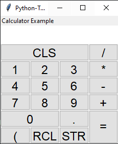

<!-- Improved compatibility of back to top link: See: https://github.com/RandyGraham/Python-TKLM/pull/73 -->
<a name="readme-top"></a>
<!--
*** Thanks for checking out the Best-README-Template. If you have a suggestion
*** that would make this better, please fork the repo and create a pull request
*** or simply open an issue with the tag "enhancement".
*** Don't forget to give the project a star!
*** Thanks again! Now go create something AMAZING! :D
-->


<!-- PROJECT SHIELDS -->
<!--
*** I'm using markdown "reference style" links for readability.
*** Reference links are enclosed in brackets [ ] instead of parentheses ( ).
*** See the bottom of this document for the declaration of the reference variables
*** for contributors-url, forks-url, etc. This is an optional, concise syntax you may use.
*** https://www.markdownguide.org/basic-syntax/#reference-style-links
-->
<!-- PROJECT LOGO -->
<br />
<div align="center">
  <a href="https://github.com/RandyGraham/Python-TMKL/">
    
  </a>

  <h3 align="center">Single File Layouting using XML for Tkinter</h3>

  <p align="center">
    Seperate your layouting logic from your program logic.
    <br />
    <a href="https://github.com/RandyGraham/Python-TKML/tree/main/Examples"><strong>Examples »</strong></a>
    <br />

</div>


<!-- TABLE OF CONTENTS -->
<details>
  <summary>Table of Contents</summary>
  <ol>
    <li>
      <a href="#about-the-project">About The Project</a>
      <ul>
        <li><a href="#built-with">Built With</a></li>
      </ul>
    </li>
    <li>
      <a href="#getting-started">Getting Started</a>
      <ul>
        <li><a href="#prerequisites">Prerequisites</a></li>
        <li><a href="#installation">Installation</a></li>
      </ul>
    </li>
    <li><a href="#usage">Usage</a></li>
    <li><a href="#roadmap">Roadmap</a></li>
    <li><a href="#contributing">Contributing</a></li>
    <li><a href="#license">License</a></li>
    <li><a href="#contact">Contact</a></li>
    <li><a href="#acknowledgments">Acknowledgments</a></li>
  </ol>
</details>


<!-- ABOUT THE PROJECT -->
## About The Project

While making some large tkinter based graphics applications I found that the code for initializing Widgets and packing them was very repetitive and cluttered up the program's actual logic. I wanted to be able to use a Markup language to structure the project because tkinter widgets are very heirarchical. I looked at other projects which were trying to solve this but none of them seemed to appeal to me because they seemed to diverge too heavily from native tkinter, meaning you would have to learn a lot from scratch.

Tkinter Widgets, like xml tags, have a name, keywords, a parent, children, and sometimes a single positional argument; I knew that with a simple tree visitor I could automatically convert the tags to widgets and pass their xml attributes to themselves after a little type conversion. This approach proved to be effective and now I can make very clean applications with easy layouts, and I can use the tkinter knowledge I already have.

Benefits:
* Cleaner Code - Your program logic is not cluttered up and hidden within tons of unimportant gui code, and the structure of your widget's masters and children are easily seen at a glance.
* Quality of Life Improvements - Grid layouts automatically assign column and row values depending on their position -- Even when widgets have different rowspans and column spans! You can pass a widget's pack() and grid() keywords to them when you initialize them. Widgets now pack with expand="1" fill="both" by default.
* Zero Dependancies - Just drag and drop this file. It doesn't use anything outside of the standard library

<p align="right">(<a href="#readme-top">back to top</a>)</p>


<!-- GETTING STARTED -->
## Getting Started

### Prerequisites

None. TKML doesn't use anything outside of the standard library. Linux users may need to install python with tkinter support.

### Installation

Drag tkml.py into your project directory.

```python
from tkml import TKMLWidget, TKMLWidgetBuilder

widget_builder = TMKLWidgetBuilder()
```


<!-- USAGE EXAMPLES -->
## Usage

### Example Simple Calculator XML
```xml
<!-->Save this file as "calculator.xml"<-->
<Frame layout="V">
    <Geometry>210x250</Geometry>
    <Title>Python-TKML Rocks!</Title>
    <Style font="Arial, 18">TButton</Style>
    <Label text="Calculator Example" />
    <Frame layout="V" inline_style="background=white;">
        <String id="buffer" />
        <Label textvariable="buffer" inline_style="background=white; font=Arial, 20;" />
    </Frame>
    <Frame layout="Grid" rowweight="1" columnweight="1">
        <Row>
            <Button text="CLS" command="clear" columnspan="3" sticky="nsew" />
            <Button text="/" command="enter_div" />
        </Row>
        <Row>
            <Button text="1" command="enter_1" />
            <Button text="2" command="enter_2" />
            <Button text="3" command="enter_3" />
            <Button text="*" command="enter_mul" />
        </Row>
        <Row>
            <Button text="4" command="enter_4" />
            <Button text="5" command="enter_5" />
            <Button text="6" command="enter_6" />
            <Button text="-" command="enter_sub" />
        </Row>
        <Row>
            <Button text="7" command="enter_7" />
            <Button text="8" command="enter_8" />
            <Button text="9" command="enter_9" />
            <Button text="+" command="enter_add" />
        </Row>
        <Row>
            <Button text="0" command="enter_0" columnspan="2" sticky="nsew" />
            <Button text="." command="enter_dot" />
            <Button text="=" command="equals" rowspan="2" sticky="nsew" />
        </Row>
        <Row>
            <String id="paren" value="(" />
            <Button textvariable="paren" command="enter_paren" />
            <Button text="RCL" command="load" />
            <Button text="STR" command="store" />
        </Row>
    </Frame>
</Frame>
```
### Example Calculator Python
```python
import tkinter as tk
from tkml import TKMLWidget, TKMLWidgetBuilder


class Calculator(TKMLWidget):
    def __init__(self, parent):
        super().__init__(parent)
        self.load_store_var = None

    def enter(self, value):
        self["buffer"].set(self["buffer"].get() + value)

    def __getattr__(self, name):
        if name.startswith("enter_") and name[-1].isdigit():
            return lambda: self.enter(name[-1])
        return AttributeError()

    def enter_mul(self):
        self.enter("*")

    def enter_div(self):
        self.enter("/")

    def enter_add(self):
        self.enter("+")

    def enter_sub(self):
        self.enter("-")

    def enter_dot(self):
        self.enter(".")

    def enter_paren(self):
        self.enter(self["paren"].get())
        self["paren"].set("(" if self["paren"].get() == ")" else ")")

    def load(self):
        if self.load_store_var is not None:
            self.enter(self.load_store_var)
    
    def store(self):
        self.load_store_var = self["buffer"].get()

    def equals(self):
        try:
            self["buffer"].set(eval(self["buffer"].get()))
        except Exception as e:
            self["buffer"].set("Error")

    def clear(self):
        self["buffer"].set("")


root = tk.Tk()
calc = Calculator(root)
TKMLWidgetBuilder().build_tkml_from_file("./calculator.xml")
calc.pack()
root.mainloop()
```




## TKML usage
#### XML Attribute Conversion
Python-TKML converts a tag's keywords into usable values before passing to the widget.
| XML Keyword  | Conversion                               | Example |
| ------------ | ---------------------------------------- | ------- |
| command      | ```callable(getattr(master, command)) ```| ```command="add_one"```
| columns      | list                                     | ```columns="id, name, stock, unit"```
| id           | ```master._tkml_variables[id] = current_widget``` | ```id="my_string_var"```
| textvariable | ```master._tkml_variables[textvariable]```   | ```textvariable="my_string_var"```
| * | if attribute is all numbers then convert attribute to int | ```width="100" becomes width=100```

#### Layouts
##### Grid
``` xml
<!-->
rowweight and columnweight are optional: 
when provided a call to parent.grid_rowconfigure
or parent.grid_columnconfigure will be called 
for each row or column managed by the frame. This 
is used to easily make the grid resizable
<-->
<Frame layout="grid" rowweight="1" columnweight="1">
    <!-->Any number of commands can be placed; they won't affect the layout<-->
    <Row>
        <!-->
        Things which would usually be passed to .grid() in 
        python are declared when you initialize the widget
        <-->
        <BigWidget columnspan="2" rowspan="2" sticky="nsew"/>
    </Row>
    <Row>
        <AnyWidget />
        <AnyWidget />
        <AnyWidget />
    </Row>
    <Row>
        <LongWidget columnspan="4" sticky="ew"/>
    </Row>
</Frame>
```
Python Equivalent
```python
frame = ttk.Frame(root)
bigWidget = BigWidget(frame)
bigWidget.grid(row=0, column=0, columnspan=2, rowspan=2, sticky="nsew")
anyWidget1 = AnyWidget(frame)
anyWidget1.grid(row=1, column=2)
anyWidget2 = AnyWidget(frame)
anyWidget2.grid(row=1, column=3)
anyWidget3 = AnyWidget(frame)
anyWidget3.grid(row=1, column=4)
longWidget = LongWidget(frame)
longWidget.grid(row=2, column=0, columnspan=5, sticky="ew")
# from rowweight="1"
for row in range(0, 3):
  frame.grid_rowconfigure(row, weight=1)
# from columnweight="1"
for col in range(0, 5):
  frame.grid_columnconfigure(col, weight=1)
frame.pack(expand=1, fill="both")
# Big  Big
# Big  Big  Any1 Any2 Any3
# Long Long Long Long Long
```

##### Vertical and Horizontal
Vertical
```xml
<Frame layout="V">
    <AnyWidget fill="x" />
    <AnyWidget expand="0" />
</Frame>
```
```python
frame = ttk.Frame(root)
any1 = AnyWidget(frame)
# by default widgets are packed using fill="both" expand="1"
any1.pack(fill="x", expand="1")
any2 = AnyWidget(frame)
any2.pack(fill="both", expand="0")
frame.pack(expand="1", fill="both")
```
Horizontal
```xml
<Frame layout="H" fill="y">
    <AnyWidget fill="x" />
    <AnyWidget expand="0" />
</Frame>
```
```python
frame = ttk.Frame(root)
any1 = AnyWidget(frame)
any1.pack(fill="x", expand="1")
any2 = AnyWidget(frame)
any2.pack(fill="both", expand="0")
frame.pack(expand="1", fill="y")
```
#### Special Widgets
##### Optionmenu
```xml
<String id="my_optionmenu">
<!-->options and textvariable are required<-->
<OptionMenu options="a, b, c, d, e, f" textvariable="my_optionmenu">
```
```python
#Equivalent
options = ["a", "b", "c", "d", "e", "f"]
my_optionmenu = tk.StringVar(value=options[0])
optionmenu = ttk.OptionMenu(parent, my_optionmenu, options[0], *options)
```
##### Table
```xml
<Table columns="id, name, price" show="heading">
    <Heading text="ID">id</Heading>
    <Heading text="Item Name">name</Heading>
    <Heading text="Price $" sort_by="num">price</Heading>
    <Column weight="1" width="80">id</Column>
</Table>
```
```python
#Equivalent
parent = ttk.Frame(root)
table = SortableTreeview(parent, columns=("id", "name", "price", show="heading"))
table.heading("id", text="ID")
table.heading("name", text="Item Name")
table.heading("price", text="Price $")
table.column("id", weight=1, width=80)
#Horizontal and Vertical Scrollbars are added automatically
v_scrollbar = ttk.Scrollbar(table, orient="vertical", command=table.yview)
h_scrollbar = ttk.Scrollbar(table, orient="horizontal", command=table.xview)
table.configure(yscrollcommand=v_scrollbar.set, xscrollcommand=h_scrollbar.set)
v_scrollbar.pack(side="right", fill="y")
table.pack(expand=1, fill="both")
h_scrollbar.pack(fill="x")
parent.pack()
```
_For more examples -- including examples about adding your own custom widgets, layouts, and commands -- please refer to the [Examples](https://github.com/RandyGraham/Python-TKML/tree/main/Examples)_

<p align="right">(<a href="#readme-top">back to top</a>)</p>


<!-- CONTRIBUTING -->
## Contributing

Contributions are what make the open source community such an amazing place to learn, inspire, and create. Any contributions you make are **greatly appreciated**.

If you have a suggestion that would make this better, please fork the repo and create a pull request. You can also simply open an issue with the tag "enhancement".
Don't forget to give the project a star! Thanks again!

1. Fork the Project
2. Create your Feature Branch (`git checkout -b feature/AmazingFeature`)
3. Commit your Changes (`git commit -m 'Add some AmazingFeature'`)
4. Push to the Branch (`git push origin feature/AmazingFeature`)
5. Open a Pull Request

<p align="right">(<a href="#readme-top">back to top</a>)</p>


<!-- LICENSE -->
## License

Distributed under the MIT License. See `LICENSE.txt` for more information.

<p align="right">(<a href="#readme-top">back to top</a>)</p>


<!-- ACKNOWLEDGMENTS -->
## Acknowledgments

* SortedTreeview from [Remi Hassan](https://stackoverflow.com/users/6424190/rami-hassan)

<p align="right">(<a href="#readme-top">back to top</a>)</p>
